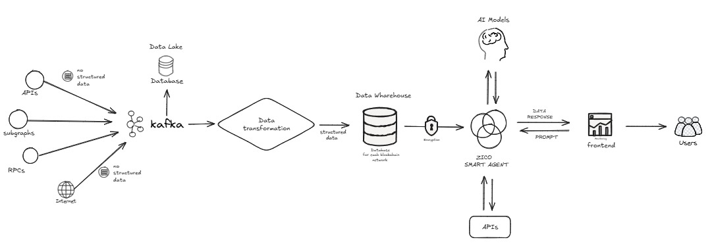

# Zico Agent

**Zico Agent** is an artificial intelligence solution based on an agent designed to extract and provide data from multiple blockchains efficiently and at scale. The core idea of the project is to integrate multiple data sources into a single access point, using language models (LLM) technology to transform user interactions into a seamless and intelligent experience.

## Objective

Zico Agent was developed to enable the querying and extraction of data from different blockchains, offering a simple and fast method to interact with these decentralized data networks. Our goal is to facilitate access to information in an accurate way, providing responses based on up-to-date blockchain data.

## Installation

Follow the steps below to install and run Zico Agent locally. Make sure Docker is installed and properly configured on your machine.

### Installation Steps

1. **Clone the repository**:

   First, clone the repository to your local machine using Git:

   ```bash
   git clone https://github.com/Panorama-Block/zico_agents.git
   ```

2. **Install Docker dependencies**:

   Navigate to the `zicoagents_dockers` folder, which contains the Docker configuration files, and run Docker Compose:

   ```bash
   cd zicoagents_dockers
   docker-compose up
   ```

   **Note:** The first time you run this command, it may take a while as Docker needs to build the containers and download the required images.

3. **Access the Frontend**:

   Once Docker Compose is up and running, open your browser and access the following URL to view the project’s frontend:

   ```
   http://localhost:3333
   ```

   The frontend is the interface where you can interact with the agent.

## Using the Project

Once the system is up and running, you can access the user interface (frontend) and chat with the agent. The agent is configured to respond to preset questions related to blockchain data, and you can even create new questions to get personalized answers.

- **Preset Questions**: The system comes with a set of predefined questions you can use to start exploring the data.
- **Create New Questions**: You can formulate new questions for the agent, which will attempt to provide the most accurate responses based on the data extracted from the blockchains.

### Use Case Examples

- Questions about the current state of a blockchain.
- Specific queries about transactions or smart contracts on particular blockchains.
- Get trending crypto news.

## Technologies Used

Zico Agent leverages several modern technologies to ensure efficiency and scalability:

- **LLM Model**: The language model used is **Ollama**, a highly optimized model capable of processing large volumes of data, with 3 billion parameters, offering intelligent and contextualized responses.
- **Development**: The solution is built in **Python**, using the **Langchain** library to develop the conversational agent, enabling seamless integration with various APIs and data sources.
- **Containerization**: We use **Docker** to ensure the application is easy to configure, scale, and run in different environments. Docker Compose is used to orchestrate the necessary containers for the system to function.

## Architecture


# Suzaku Staking System

## Overview

The Suzaku Staking System is a sophisticated DeFi protocol that implements advanced staking mechanisms with two main components: basic staking (`SuzakuStaking`) and restaking with bonus rewards (`SuzakuRestaking`). The system is designed to provide users with flexible staking options while maintaining security and efficiency.

## Components

### 1. Basic Staking (SuzakuStaking)

The basic staking contract implements core staking functionality with the following features:

- **Deposit & Withdrawal**
  - Users can deposit tokens for staking
  - Minimum staking period of 30 days
  - Support for fee-on-transfer tokens
  - Permit2 integration for gasless approvals

- **Rewards**
  - Base annual reward rate of 5% (500 basis points)
  - Dynamic reward calculation based on time elapsed
  - Configurable reward rate (max 10%)
  - Rewards are automatically calculated and distributed

- **Security Features**
  - SafeERC20 for secure token transfers
  - Reentrancy protection
  - Comprehensive error handling

### 2. Restaking System (SuzakuRestaking)

The restaking contract extends the basic staking functionality with additional features:

- **Enhanced Rewards**
  - Base staking rewards (5% APR)
  - Bonus rewards for restaking (0.5% per restake)
  - Compound interest through restaking mechanism

- **Restaking Mechanics**
  - Maximum of 10 restakes per stake
  - Restake bonus increases with each restake
  - Accumulated rewards are automatically added to stake

- **Additional Features**
  - Tracking of restake count and total restaked amount
  - Separate bonus calculation system
  - Enhanced reward distribution system

## Technical Details

### Smart Contract Architecture

```
Factory (abstract)
├── StakingFactory
│   └── SuzakuStaking
└── RestakingFactory
    └── SuzakuRestaking
```

### Key Parameters

- `MINIMUM_STAKING_PERIOD`: 30 days
- `BASIS_POINTS`: 10000 (100%)
- `DEFAULT_REWARD_RATE`: 500 (5%)
- `RESTAKE_BONUS_RATE`: 50 (0.5%)
- `MAX_RESTAKES`: 10

### Supported Tokens

The system supports various token types:
- Standard ERC20 tokens
- Fee-on-transfer tokens
- Permit2-compatible tokens

Currently integrated with:
- sAVAX
- BTC.b
- AUSD
- SolvBTC
- COQ
- ggAVAX

## Usage

### Basic Staking

```solidity
// Deposit tokens
stakingContract.deposit(recipient, amount);

// Check rewards
uint256 rewards = stakingContract.calculatePendingRewards(address);

// Withdraw staked tokens
stakingContract.withdraw(recipient, amount);

// Claim rewards
stakingContract.claimRewards();
```

### Restaking

```solidity
// Initial deposit
restakingContract.deposit(recipient, amount);

// Perform restake
restakingContract.restake();

// Check stake info
(amount, startTime, lastRewardCalculation, isStaking, restakeCount, totalRestaked) = 
    restakingContract.getStakeInfo(address);
```

## Security Features

1. **Access Control**
   - Factory pattern for controlled deployment
   - Modular permission system

2. **Safety Mechanisms**
   - Minimum staking periods
   - Maximum restake limits
   - Safe math operations

3. **Error Handling**
   - Custom error types
   - Comprehensive input validation
   - Clear error messages

## Testing

The system includes comprehensive test suites for both staking and restaking contracts:

- Unit tests for all core functions
- Integration tests for complex scenarios
- Fuzzing tests for edge cases
- Time-dependent test scenarios

## Development

### Prerequisites

- Solidity ^0.8.25
- Foundry/Forge for testing
- OpenZeppelin contracts

### Building

```bash
forge build
```

### Testing

```bash
forge test
```

## License

MIT License

## About Suzaku

Suzaku is a DeFi protocol focused on providing innovative staking solutions. The protocol emphasizes security, efficiency, and user value through its dual staking system. By combining traditional staking with restaking mechanics, Suzaku creates new opportunities for yield optimization while maintaining robust security measures.

# Chainlink Integration & Price Oracle System

## Overview

The protocol integrates Chainlink's decentralized oracle network to provide reliable price feeds and enable sophisticated price analysis and swap functionality. This integration is implemented through two main contracts: `Analysis.sol` and `Swap.sol`.

## Components

### 1. Analysis Contract

The Analysis contract provides price feed aggregation and analysis capabilities:

- **Price Feed Integration**
  - Multiple Chainlink price feeds for major assets:
    - AVAX/USD
    - BTC/USD
    - ETH/USD
    - USDC/USD
    - USDT/USD
    - DAI/USD
    - LINK/USD

- **Features**
  - Real-time price data access
  - Historical price tracking
  - Pair address computation for UniswapV2-compatible DEXes

```solidity
struct PriceFeedInfo {
    string pair;
    AggregatorV3Interface feed;
}
```

### 2. Swap Contract

The Swap contract extends the analysis capabilities with trading functionality:

- **Core Features**
  - Price-feed-based swap validation
  - Integration with UniswapV2 pairs
  - Support for ERC20 token swaps

- **Security Measures**
  - Price deviation checks
  - Slippage protection
  - Safe token transfer handling

## Technical Implementation

### Price Feed Configuration

```solidity
// Example of price feed initialization
feeds.push(PriceFeedInfo("AVAX/USD", AggregatorV3Interface(0x0A77230d17318075983913bC2145DB16C7366156)));
feeds.push(PriceFeedInfo("BTC/USD", AggregatorV3Interface(0x2779D32d5166BAaa2B2b658333bA7e6Ec0C65743)));
feeds.push(PriceFeedInfo("ETH/USD", AggregatorV3Interface(0x976B3D034E162d8bD72D6b9C989d545b839003b0)));
```

### Key Features

1. **Price Aggregation**
   - Multiple oracle sources
   - Weighted average calculations
   - Heartbeat checks for data freshness

2. **Swap Functionality**
   - Direct token swaps
   - Price-feed-based routing
   - Liquidity pool integration

3. **UniswapV2 Integration**
   - Pair address computation
   - Liquidity pool interaction
   - Price impact calculation

### Smart Contract Architecture

```
Chainlink Integration
├── Analysis.sol
│   ├── Price Feed Aggregation
│   └── Pair Analysis
└── Swap.sol
    ├── Token Swaps
    └── Price Validation
```

## Usage

### Accessing Price Feeds

```solidity
// Get price feed information
PriceFeedInfo[] public feeds;

// Access specific price feed
AggregatorV3Interface feed = feeds[0].feed;
(, int256 price,,,) = feed.latestRoundData();
```

### Computing Pair Addresses

```solidity
// Calculate UniswapV2 pair address
address pair = pairFor(factory, tokenA, tokenB);
```

## Security Considerations

1. **Oracle Security**
   - Multiple price feed sources
   - Deviation thresholds
   - Minimum update frequency checks

2. **Swap Safety**
   - Price validation
   - Maximum slippage limits
   - Reentrancy protection

3. **Error Handling**
   - Comprehensive input validation
   - Fallback price sources
   - Clear error messages

## Integration Benefits

1. **Reliable Price Data**
   - Decentralized oracle network
   - High-quality price feeds
   - Regular updates

2. **Enhanced Trading**
   - Price-aware swaps
   - Efficient routing
   - Reduced price manipulation risks

3. **Risk Management**
   - Price deviation protection
   - Liquidity validation
   - Transaction safety checks

This Chainlink integration provides a robust foundation for price discovery and trading operations within the protocol, ensuring reliable and secure token swaps while maintaining price accuracy through decentralized oracle networks.

## Requirements

To run Zico Agent efficiently on your local machine, a powerful computational setup is required, especially to run the Ollama model, which has **3 billion parameters**.

- **Minimum Requirements**:
  - High-performance processor
  - At least 16GB of RAM
  - A recommended GPU to accelerate the model's execution

## Additional Documentation

For more information and updates, check out the Panorama Block repository: [repository link](https://github.com/Panorama-Block/panorama-block).

## Team

This project was created by the **PANORAMA BLOCK** team, a group dedicated to creating innovative and efficient solutions for the blockchain ecosystem and decentralized data.
