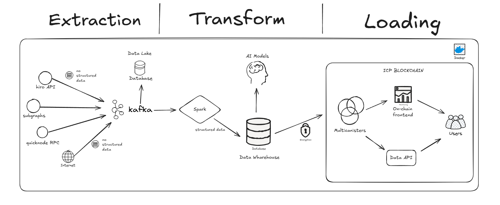

# Zico Agent

**Zico Agent** is an artificial intelligence solution based on an agent designed to extract and provide data from multiple blockchains efficiently and at scale. The core idea of the project is to integrate multiple data sources into a single access point, using language models (LLM) technology to transform user interactions into a seamless and intelligent experience.

## Objective

Zico Agent was developed to enable the querying and extraction of data from different blockchains, offering a simple and fast method to interact with these decentralized data networks. Our goal is to facilitate access to information in an accurate way, providing responses based on up-to-date blockchain data.

## Installation

Follow the steps below to install and run Zico Agent locally. Make sure Docker is installed and properly configured on your machine.

### Installation Steps

1. **Clone the repository**:

   First, clone the repository to your local machine using Git:

   ```bash
   git clone https://github.com/Panorama-Block/zico_agents.git
   ```

2. **Install Docker dependencies**:

   Navigate to the `zicoagents_dockers` folder, which contains the Docker configuration files, and run Docker Compose:

   ```bash
   cd zicoagents_dockers
   docker-compose up
   ```

   **Note:** The first time you run this command, it may take a while as Docker needs to build the containers and download the required images.

3. **Access the Frontend**:

   Once Docker Compose is up and running, open your browser and access the following URL to view the project’s frontend:

   ```
   http://localhost:3333
   ```

   The frontend is the interface where you can interact with the agent.

## Using the Project

Once the system is up and running, you can access the user interface (frontend) and chat with the agent. The agent is configured to respond to preset questions related to blockchain data, and you can even create new questions to get personalized answers.

- **Preset Questions**: The system comes with a set of predefined questions you can use to start exploring the data.
- **Create New Questions**: You can formulate new questions for the agent, which will attempt to provide the most accurate responses based on the data extracted from the blockchains.

### Use Case Examples

- Questions about the current state of a blockchain.
- Specific queries about transactions or smart contracts on particular blockchains.
- Get trending crypto news.

## Technologies Used

Zico Agent leverages several modern technologies to ensure efficiency and scalability:

- **LLM Model**: The language model used is **Ollama**, a highly optimized model capable of processing large volumes of data, with 3 billion parameters, offering intelligent and contextualized responses.
- **Development**: The solution is built in **Python**, using the **Langchain** library to develop the conversational agent, enabling seamless integration with various APIs and data sources.
- **Containerization**: We use **Docker** to ensure the application is easy to configure, scale, and run in different environments. Docker Compose is used to orchestrate the necessary containers for the system to function.

## Architecture


## Requirements

To run Zico Agent efficiently on your local machine, a powerful computational setup is required, especially to run the Ollama model, which has **3 billion parameters**.

- **Minimum Requirements**:
  - High-performance processor
  - At least 16GB of RAM
  - A recommended GPU to accelerate the model's execution

## Additional Documentation

For more information and updates, check out the Panorama Block repository: [repository link](https://github.com/Panorama-Block/panorama-block).

## Team

This project was created by the **PANORAMA BLOCK** team, a group dedicated to creating innovative and efficient solutions for the blockchain ecosystem and decentralized data.