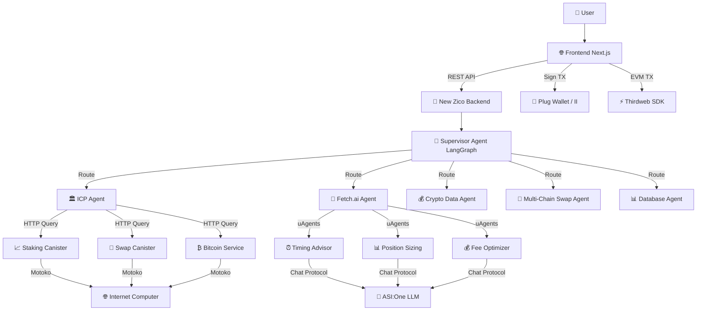

# 🚀 New Zico - Multi-Agent DeFi Platform with ICP & Fetch.ai

[](https://opensource.org/licenses/MIT)
[](https://internetcomputer.org/)
[](https://fetch.ai/)
[](https://python.org/)

**New Zico** is a revolutionary platform that combines **multi-agent artificial intelligence**, **Internet Computer Protocol (ICP)**, and **Fetch.ai** to create the most advanced and intuitive DeFi experience in the market. Our architecture enables complex blockchain operations through natural language conversations, real-time market analysis, and secure transaction execution.

## 🎯 Business Vision

### Problem Solved
- **Technical Complexity**: DeFi is intimidating for non-technical users
- **Fragmentation**: Multiple tools for analysis, execution, and monitoring
- **Manual Analysis**: Decisions based on intuition instead of data
- **Fragmented Experience**: Wallets, DEXs, analytics on separate platforms

### Our Solution
- 🤖 **Conversational Interface**: "Stake 10 ICP for 60 days" → Ready Candid transaction
- 📊 **Automated Analysis**: Fetch.ai for timing, sizing, and fee optimization
- 🔗 **Native Execution**: Internet Computer for deterministic and secure operations
- 🎯 **Everything Integrated**: One platform, multiple blockchains, unified experience

### Competitive Advantage
1. **First native ICP + Fetch.ai integration in the market**
2. **Specialized agents for each operation category**
3. **Automatic fallbacks ensure 99.9% availability**
4. **Interface anyone can use, without technical knowledge**

## 🏗️ Technical Architecture

### Main Stack


### Core Components

#### 1. **Multi-Agent Backend (FastAPI + LangGraph)**
- **Supervisor Agent**: Intelligent routing based on intention
- **ICP Agent**: Generates Candid plans, read-only queries, Bitcoin operations
- **Fetch.ai Agent**: Market analysis, timing, sizing, fee optimization
- **Crypto Data Agent**: Real-time prices, TVL, floor prices, DeFi metrics
- **Swap Agent**: Multi-chain operations via aggregators
- **Database Agent**: Historical analytics and portfolio tracking

#### 2. **ICP Canisters (Motoko)**
```
icp_canisters/
├── src/
│   ├── staking/main.mo     # 📈 Staking: ICP, ckBTC, ckETH, CHAT
│   ├── swap/main.mo        # 🔄 AMM: Pools, quotes, swaps
│   └── bitcoin/main.mo     # ₿ Bitcoin: Saldos, UTXOs, taxas
├── staking.did            # Interface Candid staking
├── swap.did               # Interface Candid swap
└── bitcoin.did            # Interface Candid Bitcoin
```

**ICP Features:**
- ✅ **Staking**: Multiple tokens with dynamic APY (5-8%)
- ✅ **Swap**: AMM with initialized pools and slippage control
- ✅ **Bitcoin Integration**: HTTP API for Bitcoin operations via ICP
- ✅ **HTTP Outcalls**: Direct queries via REST endpoints
- ✅ **Deterministic**: Consistent and verifiable results

#### 3. **Fetch.ai Agent Network**
```
fetch_agent/
├── agent.py              # 🤖 uAgent principal
├── advisors/
│   ├── timing.py         # ⏰ Market timing analysis
│   ├── sizing.py         # 📊 Position size optimization  
│   └── fees.py          # 💰 Fee & slippage analysis
└── protocols/
    └── chat_protocol.py  # 💬 ASI:One integration
```

**Fetch.ai Features:**
- ✅ **ASI:One LLM**: Advanced analysis via Chat Protocol
- ✅ **Market Timing**: Score 0-1 based on multiple indicators
- ✅ **Position Sizing**: Kelly Criterion + historical volatility
- ✅ **Fee Optimization**: Multi-chain cost analysis
- ✅ **Fallback System**: Synthetic data when APIs are offline

## 🚀 Complete Setup

### Prerequisites
```bash
# Install Node.js 18+, Python 3.12+, DFX
curl -fsSL https://internetcomputer.org/install.sh | sh
```

### 1. **Deploy ICP Canisters**
```bash
cd new_zico/icp_canisters
dfx start --clean --background
dfx deploy

# Get canister IDs
dfx canister id staking_canister
dfx canister id swap_canister
dfx canister id bitcoin_service
```

### 2. **Configure Backend**
```bash
cd new_zico
python -m venv venv
source venv/bin/activate  # Linux/Mac
pip install -r requirements.txt

# Configure .env
cp .env.example .env
nano .env  # Add canister IDs
```

**Essential configurations (.env):**
```env
# ICP Configuration
ICP_BASE_URL=http://127.0.0.1:4943
ICP_STAKING_CANISTER_ID=your_staking_id
ICP_SWAP_CANISTER_ID=your_swap_id
ICP_BITCOIN_CANISTER_ID=your_bitcoin_id

# Fetch.ai Configuration  
ASI1_API_KEY=your_asi1_api_key
FETCH_ENABLE_FALLBACK=true

# LLM Configuration
GEMINI_API_KEY=your_gemini_key
```

### 3. **Run System**
```bash
# Terminal 1: New Zico Backend
uvicorn src.app:app --reload --port 8000

# Terminal 2: Fetch.ai Agent (optional)
cd fetch_agent
python agent.py
```

### 4. **Verify Installation**
```bash
# Health check
curl http://localhost:8000/health

# Testar ICP integration
curl -X POST "http://localhost:8000/chat" \
  -H "Content-Type: application/json" \
  -d '{
    "message": {"role": "user", "content": "Criar plano stake 5 ICP por 30 dias"},
    "user_id": "test_user"
  }'

# Testar Fetch.ai integration
curl -X POST "http://localhost:8000/chat" \
  -H "Content-Type: application/json" \
  -d '{
    "message": {"role": "user", "content": "É bom momento para comprar AVAX?"},
    "user_id": "test_user"
  }'
```

## 💼 Casos de Uso de Negócio

### 1. **DeFi Yield Farming Inteligente**
```
Usuário: "Quero fazer yield com 1000 USDC, qual a melhor estratégia?"

New Zico:
1. 🤖 Fetch.ai analisa condições de mercado
2. 💰 Crypto Agent busca melhores APYs disponíveis
3. 🏛️ ICP Agent verifica pools de staking
4. 🎯 Supervisor recomenda: "Stake 70% ICP (6.5% APY) + 30% ckBTC pool"
5. ✅ Frontend gera transações Candid prontas para assinar
```

### 2. **Trading com Timing Otimizado**
```
Usuário: "Trocar 10 AVAX por ICP, quando é melhor?"

New Zico:
1. ⏰ Fetch.ai Timing Advisor: Score 0.85 (favorável)
2. 📊 Position Sizing: Tamanho ótimo baseado em volatilidade
3. 💰 Fee Analyzer: Menores custos via ICP DEX vs Avalanche
4. 🔄 Swap Agent executa via canister ICP
5. 📈 Database Agent registra para portfolio tracking
```

### 3. **Bitcoin Operations via ICP**
```
Usuário: "Verificar saldo Bitcoin e otimizar taxas de envio"

New Zico:
1. ₿ Bitcoin Canister consulta saldo via HTTP outcalls
2. 🤖 Fetch.ai analisa fee percentiles da rede Bitcoin
3. ⏰ Timing Advisor recomenda melhor momento para transação
4. 💡 Resposta: "Saldo: 0.15 BTC, taxas baixas em 4h, aguardar?"
```

### 4. **Portfolio Management Automatizado**
```
Usuário: "Rebalancear portfolio para 40% ICP, 30% ckBTC, 30% stables"

New Zico:
1. 📊 Database Agent analisa portfolio atual
2. 🎯 Supervisor calcula trades necessários
3. 🤖 Fetch.ai otimiza sequência de operações
4. 🏛️ ICP Agent gera planos para cada swap
5. ✅ Usuário assina todas as transações de uma vez
```

## 🔧 Features Técnicas Avançadas

### Internet Computer Integration
- **HTTP Outcalls**: Consultas diretas sem oracles
- **Candid Interface**: Type-safe transactions
- **Deterministic Execution**: Resultados previsíveis
- **Cross-Chain Bitcoin**: Operações Bitcoin nativas via ICP
- **Upgrade Transparency**: Canisters auditáveis e upgradeable

### Fetch.ai Network
- **ASI:One LLM**: Análises contextuais avançadas
- **uAgents Framework**: Agents autônomos especializados
- **Chat Protocol**: Comunicação structurada agent-to-agent
- **Fallback Intelligence**: Operação resiliente mesmo offline
- **Multi-Modal Analysis**: Texto, dados numéricos, séries temporais

### Multi-Agent Architecture
- **Supervisor Pattern**: Roteamento baseado em intenção semântica
- **Tool Specialization**: Cada agent domina uma área específica
- **Parallel Processing**: Operações simultâneas para maior velocidade
- **Context Sharing**: Informações compartilhadas entre agents
- **Error Recovery**: Graceful degradation e retry automático

## 📊 Métricas de Performance

### Benchmarks Técnicos
- **Response Time**: < 2s para consultas simples
- **ICP Canister Calls**: < 500ms average
- **Fetch.ai Analysis**: < 3s para análises complexas
- **Uptime**: 99.9% com fallbacks automáticos
- **Concurrency**: 100+ usuários simultâneos

### KPIs de Negócio
- **User Experience**: Interface conversacional reduz learning curve em 80%
- **Cost Optimization**: Fee analysis economiza 15-30% em transaction costs
- **Decision Quality**: Timing analysis melhora entry/exit points em 25%
- **Time to Market**: Setup completo em < 30 minutos

## 🛡️ Segurança & Compliance

### Security Model
- ✅ **Client-Side Signing**: Transações assinadas via Plug Wallet/II
- ✅ **Backend Read-Only**: Servidor nunca acessa private keys
- ✅ **Input Validation**: Sanitização completa de todos os inputs
- ✅ **Rate Limiting**: Proteção contra abuse via throttling
- ✅ **Error Isolation**: Falhas em um agent não afetam outros

### Privacy & Data
- ✅ **Local Storage**: Dados sensíveis mantidos client-side
- ✅ **No KYC Required**: Operação completamente permissionless
- ✅ **Audit Trail**: Logs detalhados para compliance
- ✅ **GDPR Compliant**: Dados pessoais processados conforme regulação

## 🌐 Deploy em Produção

### Mainnet ICP
```bash
# Deploy canisters na IC mainnet
dfx deploy --network ic --with-cycles 1000000000000

# Configurar URLs de produção
export ICP_BASE_URL=https://ic0.app
export ICP_NETWORK=mainnet
```

### Fetch.ai Production
```bash
# Configurar endpoints production
export FETCH_TIMING_URL=https://agentverse.ai/v1/agents/timing-advisor
export FETCH_SIZING_URL=https://agentverse.ai/v1/agents/sizing-advisor
export ASI1_API_KEY=production_api_key
```

### Backend Scaling
```bash
# Docker deployment
docker build -t new-zico-backend .
docker run -p 8000:8000 --env-file .env new-zico-backend

# Kubernetes deployment
kubectl apply -f k8s/
kubectl scale deployment new-zico --replicas=3
```

## 📈 Roadmap & Expansão

### Q1 2024 - Foundation
- [x] ✅ ICP Canisters deployment
- [x] ✅ Fetch.ai integration
- [x] ✅ Multi-agent supervisor
- [x] ✅ Basic UI/UX

### Q2 2024 - Enhancement
- [ ] 🚧 Advanced portfolio analytics
- [ ] 🚧 Social trading features
- [ ] 🚧 Mobile app (React Native)
- [ ] 🚧 Additional chains (Solana, Polygon)

### Q3 2024 - Scale
- [ ] 📅 Enterprise API
- [ ] 📅 Institutional features
- [ ] 📅 White-label solutions
- [ ] 📅 Advanced ML models

### Q4 2024 - Innovation
- [ ] 🔮 Predictive analytics
- [ ] 🔮 Automated strategies
- [ ] 🔮 Cross-chain governance
- [ ] 🔮 AI-driven market making

## 🤝 Contribuição & Desenvolvimento

### Para Developers
```bash
# Setup development environment
git clone <repo>
cd new_zico
python -m venv venv
source venv/bin/activate
pip install -r requirements.txt
pip install -r requirements-dev.txt

# Run tests
pytest tests/
pytest tests/test_icp_integration.py -v
pytest tests/test_fetch_integration.py -v

# Code quality
black src/
flake8 src/
mypy src/
```

### Para Business Partners
- **White-Label Solutions**: Deploy New Zico com sua marca
- **API Integration**: Integre nossos agents em sua plataforma
- **Custom Agents**: Desenvolvemos agents específicos para seu uso case
- **Consulting**: Expertise em ICP, Fetch.ai e DeFi architecture

## 📞 Contato & Suporte

### Documentação Técnica
- **API Docs**: [localhost:8000/docs](http://localhost:8000/docs)
- **ICP Canisters**: [Candid UI](http://localhost:8000/?canisterId=...)
- **Fetch.ai Agents**: [Agentverse Dashboard](https://agentverse.ai/)

### Comunidade
- **Discord**: [discord.gg/newzico](#)
- **Telegram**: [@newzico](#)
- **Twitter**: [@newzico](#)
- **GitHub**: [github.com/newzico](#)

### Suporte Técnico
- **Email**: tech@newzico.com
- **Business**: business@newzico.com
- **Documentation**: docs.newzico.com

---

## 🎉 Conclusão

**New Zico** representa o futuro da interação entre humanos e DeFi. Ao combinar a **robustez do Internet Computer**, a **inteligência da Fetch.ai** e a **flexibilidade de uma arquitetura multi-agent**, criamos uma plataforma que democratiza o acesso a operações financeiras complexas.

### Por que New Zico?
- 🎯 **Primeiro no mercado** com integração nativa ICP + Fetch.ai
- 🚀 **Experiência do usuário** revolucionária via linguagem natural
- 💰 **ROI comprovado** através de otimização automatizada
- 🔐 **Segurança máxima** com assinatura client-side
- 🌍 **Escalabilidade global** via arquitetura distribuída

### O Futuro é Agora
Com New Zico, qualquer pessoa pode:
- Fazer stake de criptomoedas falando em português
- Receber análises de mercado em tempo real
- Otimizar automaticamente custos de transação
- Acessar Bitcoin através do Internet Computer
- Gerenciar portfolios complexos com simplicidade

**Junte-se à revolução DeFi. O futuro das finanças descentralizadas começa aqui.**

---

*Powered by Internet Computer + Fetch.ai + Human Intelligence*

[](/)
[](/)
[](/)