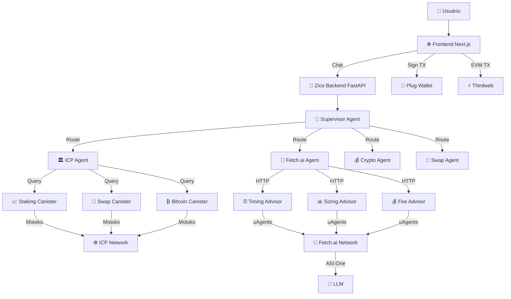

# 🚀 Zico + ICP + Fetch.ai - Integração Completa

Esta documentação descreve a integração completa entre **Zico Multi-Agent System**, **Internet Computer Protocol (ICP)**, e **Fetch.ai**, implementando um sistema híbrido para operações blockchain e análises de mercado.

## 📋 Visão Geral da Arquitetura



## 🔧 Componentes Implementados

### 1. **Backend Zico (FastAPI + LangGraph)**

#### Novos Agentes:
- **ICP Agent** (`src/agents/icp/`)
  - Gera planos de staking e swap em formato Candid
  - Consulta status via HTTP read-only
  - Integração com canisters Motoko
  - Suporte para operações Bitcoin via ICP

- **Fetch.ai Agent** (`src/agents/fetch/`)
  - Análise de timing de mercado
  - Recomendações de posição
  - Estimativas de fees/slippage
  - Métricas de rede

#### Supervisor Atualizado:
- Roteamento inteligente para novos agentes
- Suporte para consultas Bitcoin
- Integração com Chat Protocol

### 2. **ICP Canisters (Motoko)**

#### Estrutura (`icp_canisters/`):
```
icp_canisters/
├── dfx.json                    # Configuração DFX
├── src/
│   ├── staking/main.mo        # Canister de staking
│   ├── swap/main.mo           # Canister de swap  
│   └── bitcoin/main.mo        # Canister Bitcoin (HTTP)
├── staking.did               # Interface Candid staking
├── swap.did                  # Interface Candid swap
├── bitcoin.did               # Interface Candid Bitcoin
└── README.md                 # Documentação canisters
```

#### Funcionalidades:
- **Staking**: ICP, ckBTC, ckETH, CHAT com APY variável
- **Swap**: AMM com pools de liquidez inicializados
- **Bitcoin**: API HTTP para saldos, UTXOs, taxas

### 3. **Fetch.ai Agent Standalone**

#### Estrutura (`fetch_agent/`):
```
fetch_agent/
├── agent.py                  # Agente uAgents principal
├── requirements.txt          # Dependências
└── README.md                # Guia completo
```

#### Recursos:
- Chat Protocol para ASI:One
- Integração com canister Bitcoin ICP
- Processamento de linguagem natural
- Fallbacks automáticos

## 🚀 Setup Completo

### 1. **Preparar Ambiente**

```bash
# Clonar projeto
cd new_zico

# Configurar Python
python -m venv venv
source venv/bin/activate  # Linux/Mac
pip install -r requirements.txt

# Instalar DFX
sh -ci "$(curl -fsSL https://internetcomputer.org/install.sh)"
```

### 2. **Deploy ICP Canisters**

```bash
# Executar script de deploy
./deploy_icp_canisters.sh

# Ou manualmente:
cd icp_canisters
dfx start --clean --background
dfx deploy
```

### 3. **Configurar Variáveis**

```bash
# Copiar exemplo
cp env.example .env

# Editar .env com IDs dos canisters
nano .env
```

Configurações mínimas:
```env
# ICP Canisters
ICP_STAKING_CANISTER_ID=seu_canister_id
ICP_SWAP_CANISTER_ID=seu_canister_id  
ICP_BITCOIN_CANISTER_ID=seu_canister_id
ICP_BASE_URL=http://127.0.0.1:4943

# Fetch.ai
FETCH_ENABLE_FALLBACK=true
ASI1_API_KEY=sua_chave_asi_one
```

### 4. **Executar Sistema**

```bash
# Backend Zico
python -m uvicorn src.app:app --reload --port 8000

# Agente Fetch.ai (terminal separado)
cd fetch_agent
python agent.py
```

## 🧪 Testes de Integração

### 1. **Testar ICP Operations**

```bash
# Executar testes ICP
python test_icp_integration.py

# Testar individualmente
curl -X POST "http://localhost:8000/chat" \
  -H "Content-Type: application/json" \
  -d '{
    "message": {"role": "user", "content": "Criar plano stake 5 ICP por 30 dias"},
    "user_id": "test_user"
  }'
```

### 2. **Testar Fetch.ai Operations**

```bash
# Executar testes Fetch.ai
python test_fetch_integration.py

# Testar individualmente  
curl -X POST "http://localhost:8000/chat" \
  -H "Content-Type: application/json" \
  -d '{
    "message": {"role": "user", "content": "É bom momento para comprar AVAX?"},
    "user_id": "test_user"
  }'
```

### 3. **Testar Bitcoin Operations**

```bash
# Via backend Zico
curl -X POST "http://localhost:8000/chat" \
  -H "Content-Type: application/json" \
  -d '{
    "message": {"role": "user", "content": "Saldo Bitcoin de bc1q8sxznvhualuyyes0ded7kgt33876phpjhp29rs"},
    "user_id": "test_user"
  }'
```

## 🎯 Casos de Uso Completos

### Caso 1: **Staking ICP com Análise**

```javascript
// 1. Análise de timing via Fetch.ai
const timingResponse = await fetch('/chat', {
  method: 'POST',
  body: JSON.stringify({
    message: {role: 'user', content: 'É bom momento para stake ICP?'},
    user_id: 'user123'
  })
});

// 2. Se favorável, criar plano via ICP Agent
if (timingResponse.includes('Favorável')) {
  const stakeResponse = await fetch('/chat', {
    method: 'POST', 
    body: JSON.stringify({
      message: {role: 'user', content: 'Criar plano stake 10 ICP 60 dias'},
      user_id: 'user123'
    })
  });
  
  // 3. Extrair plano Candid e assinar via Plug
  const plan = extractPlanFromResponse(stakeResponse);
  await plugWallet.signTransaction(plan);
}
```

### Caso 2: **Swap ICP com Fee Analysis**

```javascript
// 1. Análise de fees via Fetch.ai
const feeAnalysis = await fetch('/chat', {
  method: 'POST',
  body: JSON.stringify({
    message: {role: 'user', content: 'Custos swap 5 ICP para ckBTC'},
    user_id: 'user123'
  })
});

// 2. Criar plano de swap
const swapPlan = await fetch('/chat', {
  method: 'POST',
  body: JSON.stringify({
    message: {role: 'user', content: 'Plano swap 5 ICP ckBTC slippage 2%'},
    user_id: 'user123'
  })
});

// 3. Executar via Plug
await plugWallet.signTransaction(swapPlan.metadata);
```

### Caso 3: **Bitcoin Operations via ICP**

```javascript
// Consultar saldo Bitcoin via canister ICP
const balanceResponse = await fetch('/chat', {
  method: 'POST',
  body: JSON.stringify({
    message: {
      role: 'user', 
      content: 'Saldo Bitcoin bc1q8sxznvhualuyyes0ded7kgt33876phpjhp29rs'
    },
    user_id: 'user123'
  })
});

// UTXOs e taxas
const utxoResponse = await fetch('/chat', {
  method: 'POST',
  body: JSON.stringify({
    message: {role: 'user', content: 'UTXOs Bitcoin bc1q8sxz...'},
    user_id: 'user123'
  })
});
```

## 🔗 Agente Fetch.ai Standalone

### Setup ASI:One

1. **Obter Chave API**:
   - Acesse https://asi1.ai/
   - Login com Google/Fetch Wallet
   - Developer → Create New API Key

2. **Configurar Agent**:
   ```bash
   cd fetch_agent
   echo "ASI1_API_KEY=sua_chave" > .env
   python agent.py
   ```

3. **Conectar Agentverse**:
   - Acesse https://agentverse.ai/agents
   - Encontre seu agente
   - Conectar Mailbox
   - Testar Chat

### Queries Suportadas

```
"What's the balance of address bc1q8sxz...?"
"List UTXOs for bc1q8sxz..."  
"Current Bitcoin fees?"
"Generate new Bitcoin address"
```

## 📊 Monitoramento e Debug

### Logs

```bash
# Backend Zico
tail -f logs/zico_agent.log

# Canisters ICP
dfx logs staking
dfx logs swap
dfx logs bitcoin

# Agente Fetch.ai
tail -f fetch_agent/agent.log
```

### Métricas

- **ICP**: Via Candid UI e dfx status
- **Fetch.ai**: Logs do uAgent
- **Backend**: FastAPI metrics endpoint
- **Frontend**: Console logs

## 🛡️ Segurança

### ICP Security
- ✅ Transações assinadas client-side via Plug
- ✅ Backend apenas gera "planos" 
- ✅ Validação de parâmetros
- ✅ Timeouts configuráveis

### Fetch.ai Security  
- ✅ Fallbacks automáticos
- ✅ Rate limiting implícito
- ✅ API keys segregadas
- ✅ Dados sintéticos quando offline

### Backend Security
- ✅ CORS configurado
- ✅ Input validation
- ✅ Error handling
- ✅ Logging detalhado

## 🚨 Troubleshooting

### Problemas Comuns

1. **Canister não responde**:
   ```bash
   dfx ping
   dfx canister status bitcoin
   dfx deploy bitcoin --mode reinstall
   ```

2. **Agente não roteia corretamente**:
   - Verificar imports em supervisor
   - Confirmar agent names
   - Testar tools isoladamente

3. **Fetch.ai timeout**:
   - Ativar FETCH_ENABLE_FALLBACK=true
   - Verificar URLs dos advisors
   - Testar com dados mock

### Debug Steps

```bash
# 1. Verificar saúde geral
curl http://localhost:8000/health

# 2. Testar agentes disponíveis
curl http://localhost:8000/agents/available

# 3. Testar tools diretamente
python -c "
from src.agents.icp.tools import icp_plan_stake_tool
print(icp_plan_stake_tool(500000000, 2592000))
"

# 4. Verificar canisters
dfx canister call bitcoin http_request '(record {
  url = "/";
  method = "GET";
  body = vec {};
  headers = vec {};
})'
```

## 🔄 Deploy em Produção

### 1. **Mainnet ICP**

```bash
# Deploy na IC mainnet
dfx deploy --network ic

# Atualizar .env
ICP_BASE_URL=https://ic0.app
ICP_STAKING_CANISTER_ID=mainnet_id
```

### 2. **Fetch.ai Production**

```bash
# Configure endpoints reais
FETCH_TIMING_URL=https://agentverse.ai/v1/agents/timing-advisor/chat
FETCH_API_KEY=production_key
```

### 3. **Backend Production**

```bash
# Docker deploy
docker build -t zico-agents .
docker run -p 8000:8000 --env-file .env zico-agents

# Or PM2
pm2 start "uvicorn src.app:app --host 0.0.0.0 --port 8000" --name zico-backend
```

## 📈 Próximos Passos

### Roadmap Técnico

- [ ] **ICP Enhancements**
  - SNS tokens support
  - NNS governance integration
  - Batch operations
  - Advanced staking strategies

- [ ] **Fetch.ai Expansions**  
  - More specialized advisors
  - ML predictions
  - Portfolio optimization
  - Real-time alerts

- [ ] **Integration Features**
  - Automated flows (analysis → action)
  - Performance dashboard  
  - Strategy backtesting
  - Multi-chain orchestration

### Business Logic

- [ ] User authentication
- [ ] Transaction history
- [ ] Portfolio tracking
- [ ] Risk management
- [ ] Compliance features

## 🤝 Contribuição

1. Fork o repositório
2. Criar feature branch
3. Implementar mudanças
4. Adicionar testes
5. Submit PR

## 📄 Licença

MIT License - Veja LICENSE para detalhes.

---

## 🎉 Conclusão

Esta integração demonstra um sistema completo e funcional que combina:

- **Zico Multi-Agent System** para orquestração inteligente
- **Internet Computer Protocol** para operações blockchain seguras  
- **Fetch.ai** para análises de mercado avançadas

O resultado é uma plataforma robusta que permite:
- ✅ Operações DeFi via linguagem natural
- ✅ Análises de mercado em tempo real
- ✅ Segurança blockchain nativa
- ✅ Experiência de usuário simplificada

**🚀 Ready to revolutionize DeFi with AI agents!**

---

*Powered by Fetch.ai + Internet Computer + Zico | Built for the future of finance*
